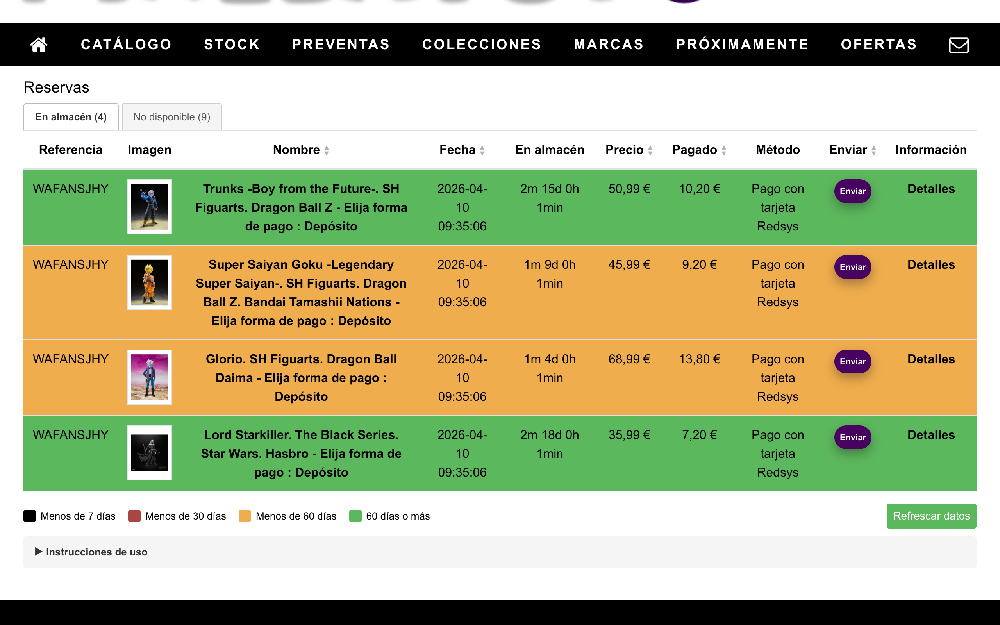
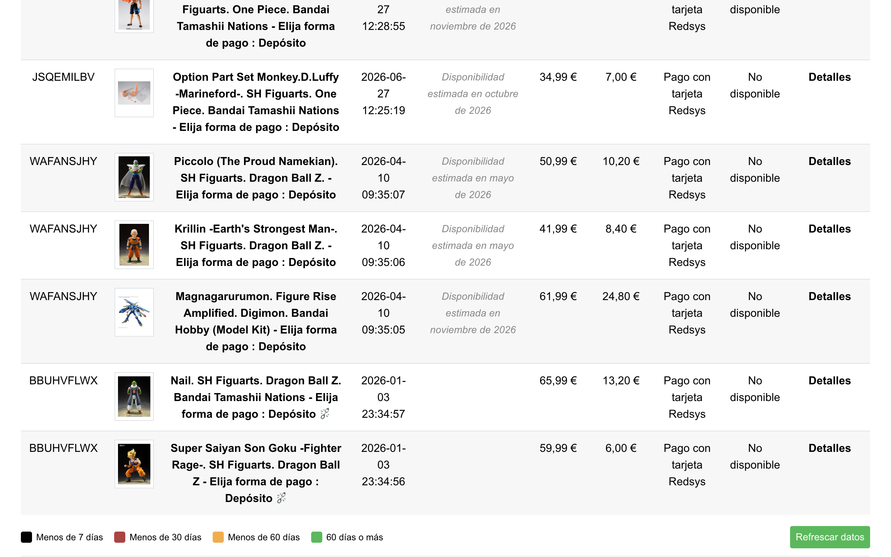
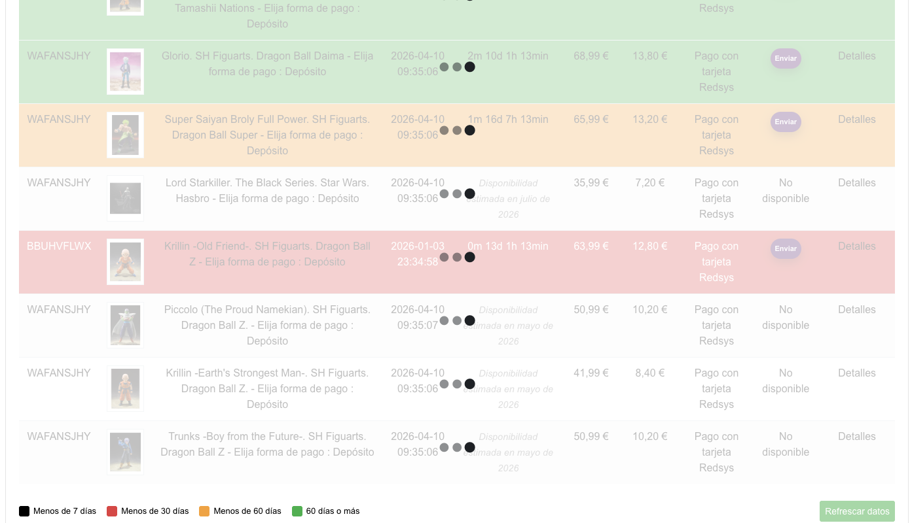
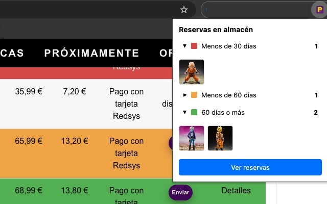
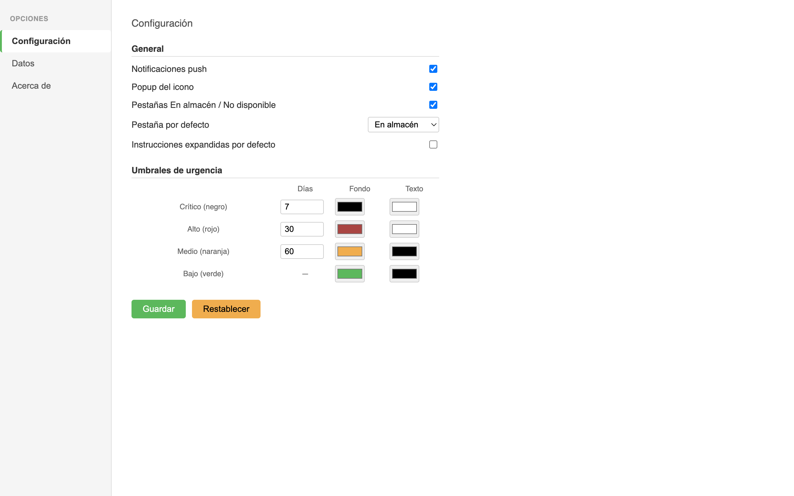

# Chrome Web Store — Ficha de la extensión

## Versión publicada
v1.7.0

## Ficha de Play Store

### Detalles del producto

#### Título del paquete
Pixelatoy Preorder Manager

#### Resumen del paquete (máx. 132 caracteres)
Mejora la tabla de reservas de Pixelatoy: fechas de almacén, enlaces a productos, detección de enlaces rotos y refresco de datos.

#### Descripción (máx. 16000 caracteres)
Pixelatoy Preorder Manager añade funcionalidades avanzadas a la tabla de reservas de Pixelatoy para ayudarte a gestionar tus pedidos pendientes.

Funcionalidades principales:

- Obtención automática de la fecha de entrada en almacén y del enlace al producto al cargar la página.
- Fecha estimada de disponibilidad para productos aún no disponibles, usada también para ordenar.
- Contador de tiempo restante hasta el límite de almacén (fecha de entrada + 3 meses), actualizado cada minuto.
- Coloreado de filas por urgencia: negro (<7 días), rojo (<30 días), naranja (<60 días), verde (≥60 días).
- Resolución automática de enlaces rotos: cuando la URL de un producto deja de ser válida, la extensión la busca por referencia en la API de Pixelatoy. Los enlaces resueltos muestran 🔀; los no resolvibles muestran ⛓️‍💥 y se reintentan al refrescar.
- Botón "Refrescar datos" para actualizar la información y reintentar enlaces rotos. Muestra un toast con el número de cambios pendientes y un badge rojo por tab cuando los cambios están en el tab inactivo.
- Ordenación por columnas con ciclo ascendente/descendente/original.
- Sección "Reservas no encontradas" para productos eliminados de la tabla pero con datos guardados.
- Tabs "En almacén" / "No disponible": separa los productos listos para enviar de los no disponibles, con tab activo configurable y restaurado automáticamente al recargar.
- Página de opciones para configurar el comportamiento de la extensión: notificaciones, popup, tabs, tab por defecto, umbrales de urgencia y colores de cada rango.
- Exportación e importación de todos los datos (fechas, configuración) desde la página de opciones.
- Popup del icono con resumen de productos agrupados por urgencia (configurable; si está desactivado, el icono abre directamente la página de reservas).
- Al hacer click en el icono con el popup desactivado, abre o enfoca directamente la página de reservas.
- Soporte bilingüe ES/EN: la extensión detecta automáticamente el idioma de la página y adapta todos los textos.

Compatibilidad: Chrome con Manifest V3. Funciona en la página de reservas de Pixelatoy en español e inglés.

#### Categoría
Herramientas

#### Idioma
Español (es)

### Recursos gráficos

#### Capturas de pantalla (máx. 5 capturas)

1. **Pestaña "En almacén"**. Muestra solo los artículos ya disponibles en el almacén, cada uno coloreado por su urgencia y con su contador. También muestra la leyenda de colores, el botón de "Refrescar datos" y las instrucciones colapsadas. 

2. **Pestaña "No disponible"**. Muestra el resto de artículos que aún no están disponibles junto con su texto de disponibilidad estimada. Hay ejemplos de artículos con icono de enlace roto.

3. **Refresco de datos**. Filas con overlay de refetch tras pulsar "Refrescar datos". La captura es de cuando no había pestañas, pero cumple con el objetivo.

4. **Popup del icono**. Muestra el popup con las urgencias alta y leve desplegadas mostrando las imágenes de sus artículos.

5. **Página de opciones**. Vista de la página de opciones con sidebar vertical y los tres paneles: Configuración (notificaciones, popup, tabs, umbrales, colores), Datos (exportar/importar) y Acerca de. En la captura el panel activo es el de Configuración.

## Privacidad

### Una sola finalidad

#### Descripción de la finalidad única (máx. 1000 caracteres)
Esta extensión mejora exclusivamente la página de reservas de Pixelatoy, añadiendo seguimiento de fechas de almacén, enlaces a productos y herramientas de gestión personal de pedidos.

### Justificación de permiso

#### Justificación de storage (máx. 1000 caracteres)
Se usa chrome.storage.local para guardar las fechas de entrada en almacén, URLs de productos, imágenes y estado de enlaces introducidos o obtenidos automáticamente por el usuario.

#### Justificación de notifications (máx. 1000 caracteres)
Se envían notificaciones locales para avisar al usuario cuando un producto está próximo a superar el límite de almacén (3 meses desde la fecha de entrada).

#### Justificación de alarms (máx. 1000 caracteres)
Se usan alarmas para programar la comprobación diaria de los límites de almacén y lanzar las notificaciones correspondientes.

#### Justificación de tabs (máx. 1000 caracteres)
Se usa chrome.tabs para abrir la página de reservas de Pixelatoy desde el popup de la extensión y, cuando el popup está desactivado, al hacer click en el icono de la extensión.

#### Justificación de Permiso de host (máx. 1000 caracteres)
El permiso sobre https://www.pixelatoy.com/* es necesario para obtener automáticamente la fecha de entrada en almacén y la URL del producto desde las páginas de detalle de Pixelatoy.

#### Utilizas código remoto?
- (x) No, no estoy usando Código remoto
- ( ) Sí, estoy usando Código remoto (Justificación max 1000 chars)

### Uso de datos

#### ¿Qué datos de usuario piensas recoger ahora o en el futuro?
- [ ] Información de identificación personal
- [ ] Información sanitaria
- [ ] Datos financieros y de pagos
- [ ] Información de autenticación
- [ ] Comunicaciones personales
- [ ] Ubicación
- [ ] Historial web
- [ ] Actividad del usuario
- [ ] Contenido del sitio web

#### Certifico que las siguientes afirmaciones son ciertas:
- [x] No vendo ni transfiero datos de usuario a terceros, fuera de los casos prácticos aprobados
- [x] No uso ni transfiero datos de usuario para fines no relacionados con la finalidad única de mi elemento
- [x] No uso ni transfiero datos de usuarios para determinar su situación crediticia ni para ofrecer préstamos

### Política de Privacidad

#### URL de la Política de Privacidad
https://vegekku.github.io/pixelatoy-extension/privacy.html

## Instrucciones de la prueba

### Instrucciones adicionales (máx. 500 caracteres)
Esta extensión funciona exclusivamente en la página de reservas de Pixelatoy (https://www.pixelatoy.com/es/module/preorder/preorderorderdetails), que requiere una cuenta con reservas activas para mostrar contenido.

Para verificar el funcionamiento sin cuenta, se puede cargar la extensión en modo desarrollador y comprobar que el content script se inyecta correctamente en la URL indicada sin errores en consola.